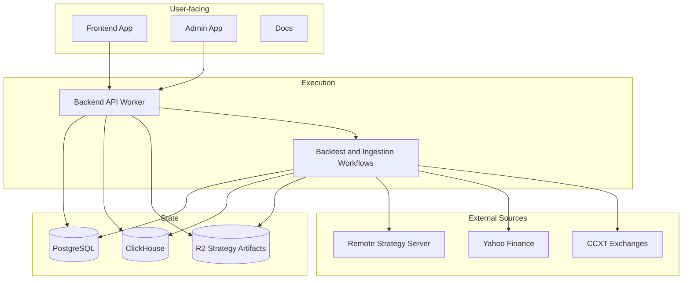
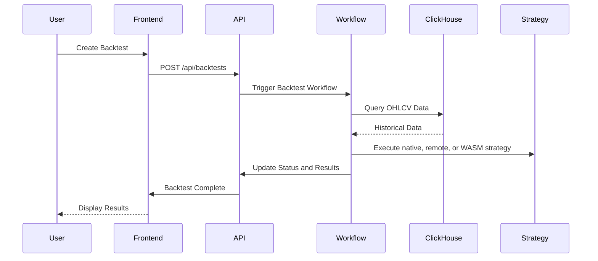

# Self-Hosting Architecture

This guide explains the moving parts behind a self-hosted Quantago deployment. It focuses on responsibilities, data flow, and operational boundaries.

## System Overview

At a high level, Quantago has five responsibilities:

- authenticate users and enforce access control
- query or ingest market data
- queue and execute backtests
- load strategy definitions and runtime artifacts
- serve frontend and admin experiences

## Service Map

## Component Responsibilities

### Backend API Worker

The backend is the control plane.

- exposes REST endpoints under `/api/*`
- handles auth and session resolution
- reads and writes metadata in PostgreSQL
- reads market data from ClickHouse or live providers
- queues long-running work through workflow bindings

### Frontend App

The frontend is the user-facing trading interface.

- authenticated users create and review backtests here
- it depends on the backend for session state, strategy catalog data, and results

### Admin App

The admin app is optional but useful in self-hosted setups.

- manages ingestion operations
- uses admin-only routes and SSE for monitoring
- shares the same backend but requires an admin role

### PostgreSQL

PostgreSQL stores relational platform state:

- users and sessions
- backtest metadata
- strategy definitions and versions
- ingestion metadata

### ClickHouse

ClickHouse is the time-series store for OHLCV data. Quantago uses it as the durable source for backtests and as the destination for ingestion workflows.

### Strategy Artifacts

WASM modules can be stored as versioned artifacts. In production, this is handled through the `STRATEGY_ARTIFACTS` binding backed by R2.

## Request Flow

### Market data query

1. A client calls `/api/market-data/ticks`.
2. The backend validates symbol, range, and timeframe.
3. The backend pulls data from ClickHouse or a live provider.
4. The API returns normalized ticks.

### Backtest execution

## Auth Model

Most API routes are session-protected.

Public routes:

- `/api/auth/*`
- `/api/health`
- `/api/market-data/*`

Protected routes resolve the current user through Better Auth session middleware. Admin routes require the authenticated user to have the `admin` role.

## Production Notes

When self-hosting, treat the backend as the single source of truth for:

- session validation
- strategy catalog state
- workflow orchestration
- policy enforcement between frontend, admin, and runtime integrations

Continue with [Self-Hosting Deployment](/self-hosting/deployment).