# Architecture

This document provides a comprehensive overview of the Quantago architecture, including system design, data flows, and infrastructure components.

## Table of Contents

- [System Overview](#system-overview)
- [High-Level Architecture](#high-level-architecture)
- [Component Architecture](#component-architecture)
- [Data Architecture](#data-architecture)
- [Authentication & Authorization](#authentication--authorization)
- [Ingestion Pipeline](#ingestion-pipeline)
- [Backtest Execution](#backtest-execution)
- [Strategy Protocol](#strategy-protocol)
- [Infrastructure & Deployment](#infrastructure--deployment)

## System Overview

Quantago is a cloud-native, serverless application designed for algorithmic trading strategy backtesting and market data management. Built on Cloudflare's edge infrastructure, it provides:

- **Fast backtesting execution** using Cloudflare Workers
- **Scalable data storage** with ClickHouse for OHLCV data
- **Real-time ingestion monitoring** via Server-Sent Events (SSE)
- **Admin controls** for data management
- **Role-based access control** for secure operations

## High-Level Architecture

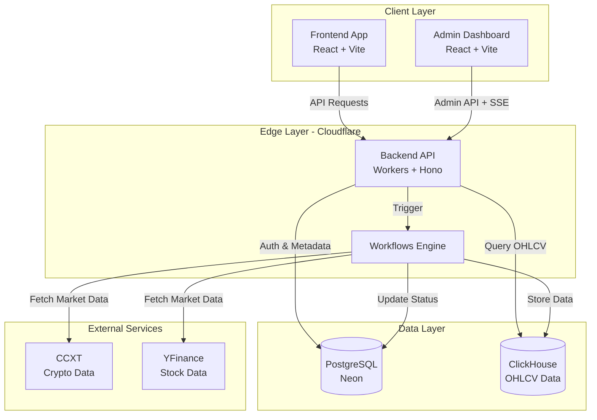

## Component Architecture

### Frontend Services

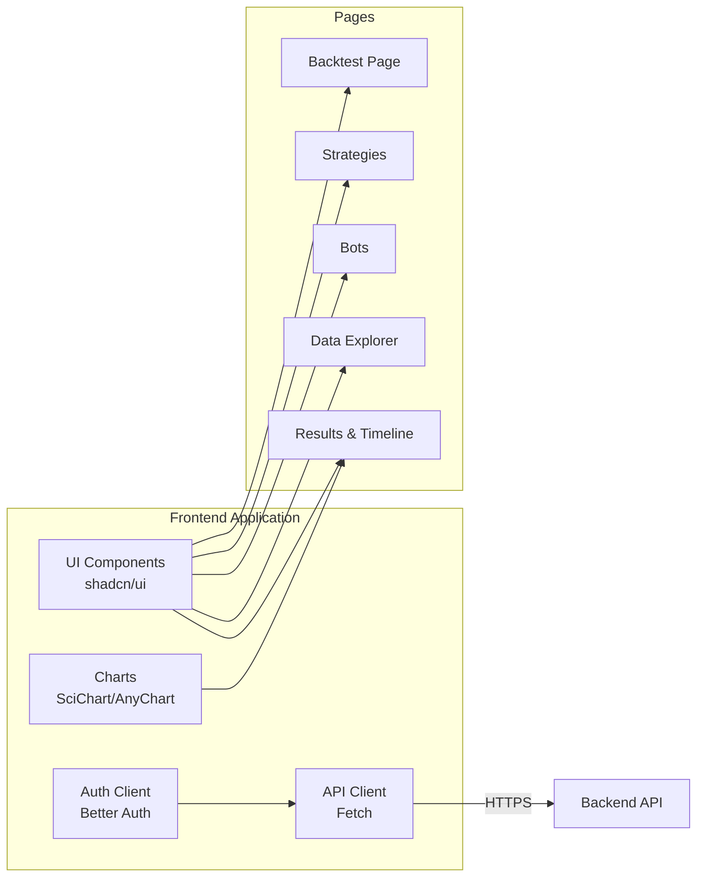

### Admin Dashboard

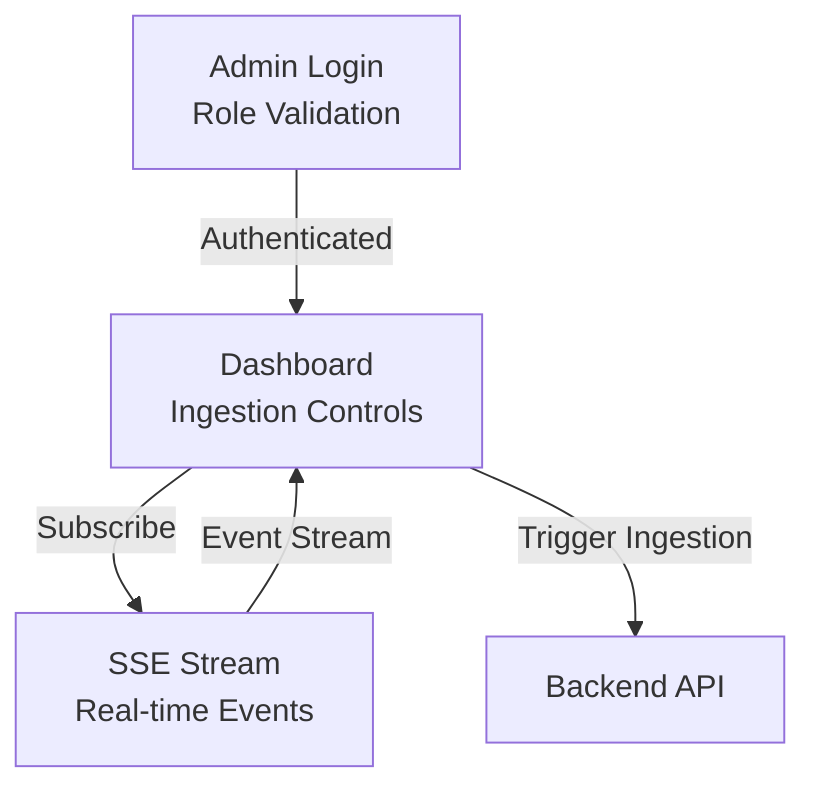

### Backend API

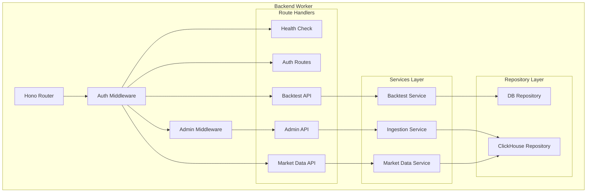

## Data Architecture

### Database Schema

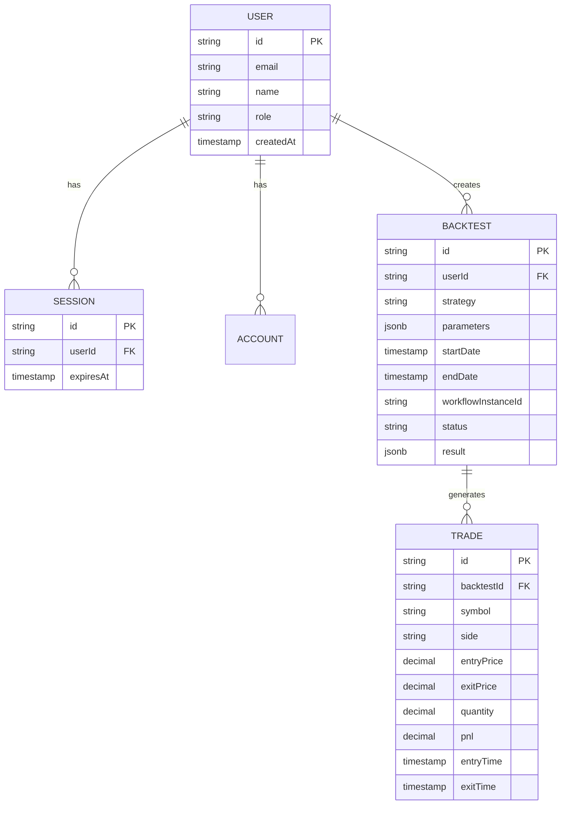

### ClickHouse Schema

```sql
-- OHLCV Data Table
CREATE TABLE market_data.ohlcv (
    symbol String,
    timeframe String,
    timestamp DateTime64(3),
    open Float64,
    high Float64,
    low Float64,
    close Float64,
    volume Float64,
    asset_type String,
    source String,
    ingested_at DateTime64(3)
) ENGINE = MergeTree()
PARTITION BY toYYYYMM(timestamp)
ORDER BY (symbol, timeframe, timestamp);
```

### Data Flow

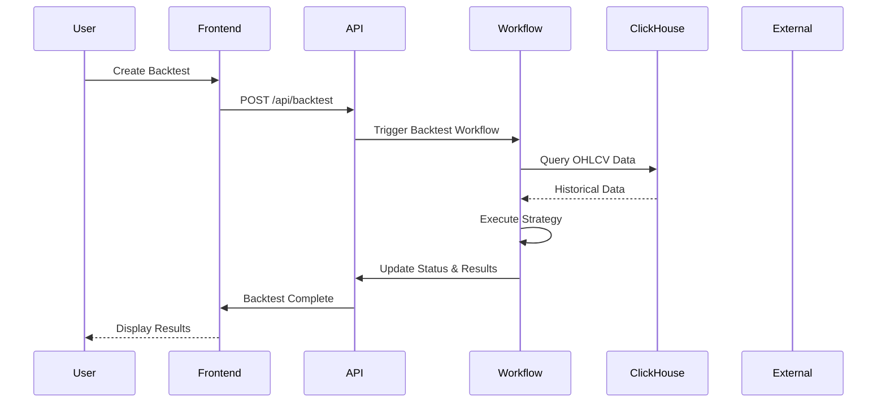

## Authentication & Authorization

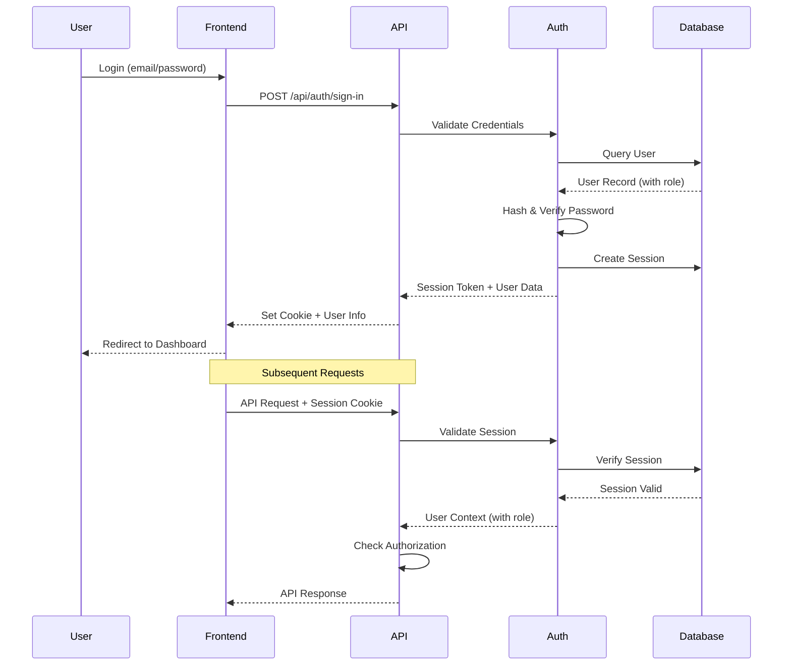

### Role-Based Access Control

| Role | Frontend Access | Admin Access | API Permissions |
|------|----------------|--------------|-----------------|
| `user` | ✅ Full | ❌ Denied | Read backtests, create backtests, query market data |
| `admin` | ✅ Full | ✅ Full | All user permissions + trigger ingestion, view system status, manage users |

## Ingestion Pipeline

### Architecture

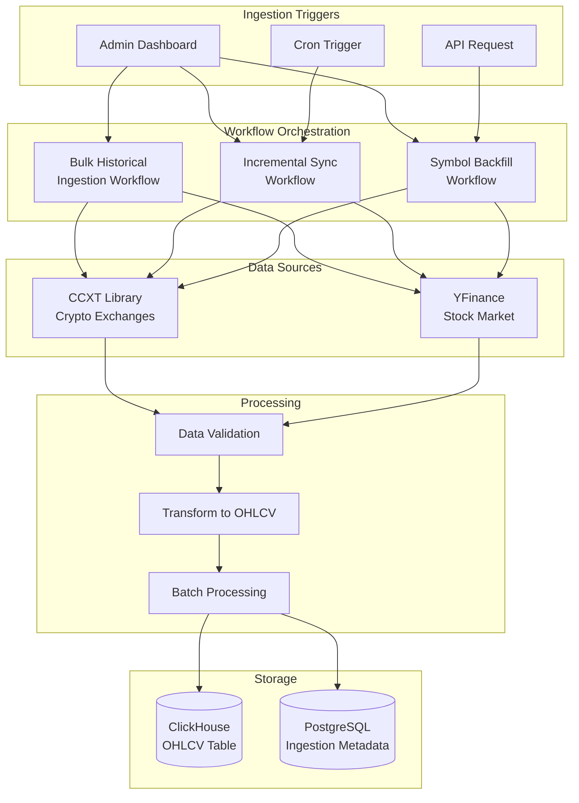

### Workflow Details

#### Bulk Historical Ingestion

Fetches complete historical data for multiple symbols:

1. **Input**: Asset type, timeframe, symbol list (optional)
2. **Process**: 
   - Fetch symbols for asset type
   - For each symbol: fetch all available historical data
   - Batch insert into ClickHouse
   - Update metadata with ingestion status
3. **Output**: Total rows ingested, success/failure per symbol

#### Incremental Sync

Keeps data up-to-date with latest market activity:

1. **Input**: Asset type, timeframe, symbol list (optional)
2. **Process**:
   - Query last ingested timestamp per symbol
   - Fetch new data from last timestamp to now
   - Insert only new records
   - Update metadata
3. **Scheduling**: Runs every 1 hour (configurable)

#### Symbol Backfill

Fills missing data for a specific symbol:

1. **Input**: Symbol, asset type, timeframe, start date (optional)
2. **Process**:
   - Identify gaps in existing data
   - Fetch missing data ranges
   - Insert missing records
3. **Use Case**: Fix data gaps, onboard new symbols

### Real-Time Monitoring

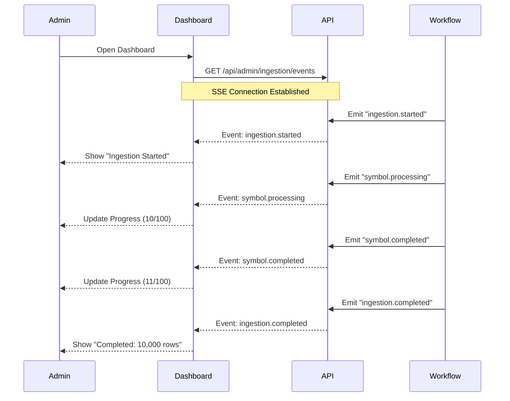

## Backtest Execution

### Workflow Process

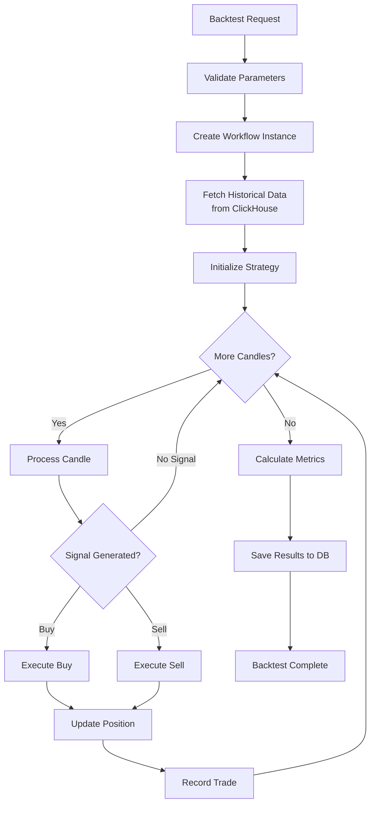

### Strategy Interface

Strategies no longer need to be coupled to the platform runtime. The platform evaluates a language-agnostic Strategy Protocol and dispatches to one of three runtimes:

- `native`: in-process TypeScript strategy execution
- `remote`: HTTP call to an external strategy service
- `wasm`: reserved for future high-performance strategy execution

See [docs/STRATEGY_PROTOCOL.md](docs/STRATEGY_PROTOCOL.md) for the full request and response contract.

## Strategy Protocol

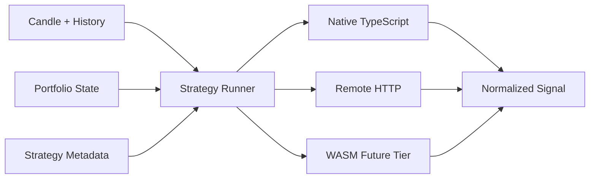

The Strategy Runner normalizes every runtime behind the same protocol:

- Input: candle, bounded history window, portfolio snapshot, parameters, execution context
- Output: `BUY`, `SELL`, or `HOLD` plus optional `size`, `reason`, and diagnostic metadata

This keeps execution, P&L, storage, and charting inside the platform while making strategy implementations portable across languages.

### Supported Strategies

- **Dual Moving Average**: Crossover-based trend following
- **RSI Divergence**: Momentum reversal detection
- **Bollinger Bands**: Volatility breakout/mean reversion
- **Ichimoku Cloud**: Multi-indicator trend system
- **Price Action**: Chart pattern recognition
- **Grid Trading**: Range-bound profit taking
- **Scalping**: High-frequency small profit targeting
- **Mean Reversion**: Statistical arbitrage
- **Momentum**: Trend continuation
- **Breakout**: Support/resistance breaks

## Infrastructure & Deployment

### Cloudflare Architecture

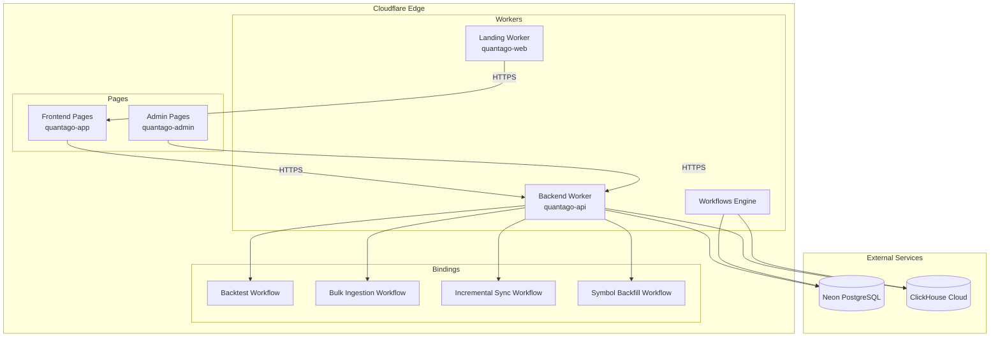

### Deployment Pipeline

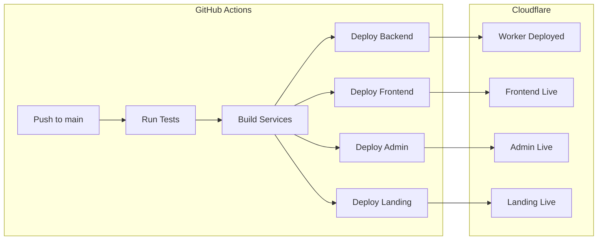

### Infrastructure as Code

The platform uses Pulumi for infrastructure management:

```typescript
// Backend Worker with Workflow bindings
const backendWorker = new cloudflare.WorkerScript("quantago-api", {
  content: workerCode,
    name: "quantago-api",
  compatibilityDate: "2024-01-01",
  workflows: [
    { name: "backtest-workflow", binding: "BACKTEST_WORKFLOW" },
    { name: "bulk-ingestion-workflow", binding: "BULK_HISTORICAL_INGESTION_WORKFLOW" },
    { name: "incremental-sync-workflow", binding: "INCREMENTAL_SYNC_WORKFLOW" },
    { name: "symbol-backfill-workflow", binding: "SYMBOL_BACKFILL_WORKFLOW" },
  ],
});

// Frontend Pages Project
const frontendPages = new cloudflare.PagesProject("quantago-app", {
  accountId: cloudflareAccountId,
    name: "quantago-app",
  productionBranch: "main",
});

// Admin Pages Project
const adminPages = new cloudflare.PagesProject("quantago-admin", {
  accountId: cloudflareAccountId,
    name: "quantago-admin",
  productionBranch: "main",
});
```

### Scaling Characteristics

| Component | Scaling Strategy | Limits |
|-----------|-----------------|--------|
| **Workers** | Auto-scale across global edge network | 50ms CPU time per request |
| **Workflows** | Durable execution with automatic retry | 30 days max duration |
| **ClickHouse** | Vertical scaling + sharding | Based on plan |
| **PostgreSQL** | Auto-scaling compute + storage | Based on plan |
| **Pages** | Global CDN with edge caching | Unlimited requests |

### Performance Characteristics

- **API Response Time**: < 50ms (p50), < 200ms (p99)
- **Workflow Execution**: 1-5 minutes per backtest (depends on data volume)
- **Data Ingestion**: 1,000-10,000 OHLCV rows/second
- **ClickHouse Queries**: < 100ms for 1M rows
- **Global Latency**: < 50ms from 95% of internet users

## Security

### Authentication

- **Method**: Session-based authentication with better-auth
- **Session Storage**: PostgreSQL with encrypted cookies
- **Password Hashing**: bcrypt with salt
- **Session Duration**: 7 days (configurable)

### Authorization

- **Role System**: User vs Admin roles
- **Middleware**: Route-level authorization checks
- **Admin Endpoints**: Protected by `requireAdmin` middleware

### Data Security

- **TLS**: All traffic encrypted with HTTPS
- **Database**: Encrypted connections (SSL/TLS)
- **Secrets**: Managed via Cloudflare Workers Secrets
- **Environment Variables**: Never committed to version control

### CORS Configuration

```typescript
app.use('*', cors({
    origin: ['https://app.quantago.co', 'https://admin.quantago.co'],
  credentials: true,
}));
```

## Monitoring & Observability

### Logging

- **Workers Logs**: `wrangler tail` for real-time logs
- **Workflow Logs**: Captured in workflow execution history
- **Error Tracking**: Console errors logged to Workers analytics

### Metrics

- **Worker Metrics**: Request count, duration, error rate
- **Workflow Metrics**: Success rate, execution time, retry count
- **Database Metrics**: Query performance, connection pool

### Health Checks

```http
GET /api/health
```

Response:
```json
{
  "status": "ok",
  "timestamp": "2026-03-10T12:00:00Z",
  "services": {
    "database": "ok",
    "clickhouse": "ok",
    "workflows": "ok"
  }
}
```

## Development Workflow

### Local Development

1. **Start Backend**: `cd services/backend && pnpm dev`
2. **Start Frontend**: `cd services/frontend && pnpm dev`
3. **Start Admin**: `cd services/admin && pnpm dev`

### Code Quality

- **TypeScript**: Strict mode enabled
- **Linting**: ESLint with recommended rules
- **Type Checking**: Pre-commit type checks
- **Testing**: Unit tests for critical functions

### Coding Standards

See:
- [Backend Standards](standards/backend-standards.md)
- [Component Standards](standards/component-standards.md)
- [Zustand Standards](standards/zustand-standards.md)

## Future Enhancements

### Planned Features

- [ ] WebSocket support for real-time backtest updates
- [ ] Multi-asset portfolio backtesting
- [ ] Paper trading mode with live data
- [ ] Strategy optimization with genetic algorithms
- [ ] Custom indicator builder
- [ ] Backtest comparison and analysis tools
- [ ] Export to multiple formats (CSV, Excel, JSON)
- [ ] Advanced charting with custom indicators
- [ ] Risk management tools (position sizing, stop loss)
- [ ] Performance attribution analysis

### Technical Debt

- [ ] Add comprehensive unit test coverage
- [ ] Implement integration tests for workflows
- [ ] Add E2E tests with Playwright
- [ ] Set up proper CI/CD for infrastructure changes
- [ ] Add database migration versioning
- [ ] Implement blue-green deployment strategy

## References

- [Cloudflare Workers Documentation](https://developers.cloudflare.com/workers/)
- [Cloudflare Workflows Documentation](https://developers.cloudflare.com/workflows/)
- [Hono Framework](https://hono.dev/)
- [Better Auth](https://www.better-auth.com/)
- [ClickHouse Documentation](https://clickhouse.com/docs)
- [CCXT Documentation](https://docs.ccxt.com/)
